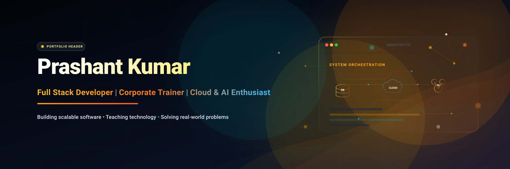
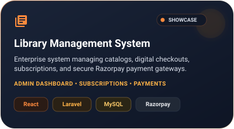
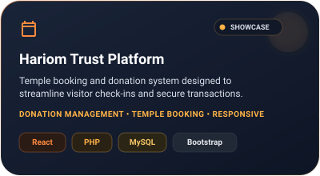
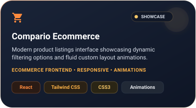
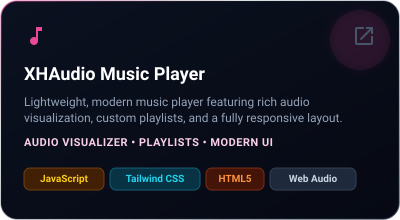
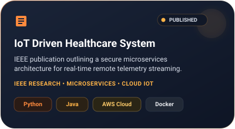

<!--
━━━━━━━━━━━━━━━━━━━━━━━━━━━━━━━━━━━━━━━━━━━━━━━━━━━━━━━━━━━━━━━━━━━━━━━━━━━━━
  PRASHANT KUMAR - PREMIUM PORTFOLIO GITHUB PROFILE README
  Visual language: Dribbble warm orange + deep navy SaaS theme.
  
  CONFIGURATION NOTE:
  This profile is pre-configured with all your custom usernames:
  - GitHub username: prashantkumar7906
  - LinkedIn: prashant-kumar-88b589230
  - Email: prashantkumar.work01@gmail.com
  - Instagram: prashantkumar5287
━━━━━━━━━━━━━━━━━━━━━━━━━━━━━━━━━━━━━━━━━━━━━━━━━━━━━━━━━━━━━━━━━━━━━━━━━━━━━
-->

  <!-- Hero Banner (Warm Orange + Deep Navy SaaS Theme) -->
  

    

  <!-- Visitor Counter & Cohesive Social Badges -->
  
  &nbsp;&nbsp;
  
  &nbsp;&nbsp;
  

    

  <!-- Website-style Navigation Bar -->
  <table border="0" cellpadding="0" cellspacing="0" style="background:#1A2438; border: 1px solid rgba(255,255,255,0.08); border-radius: 20px; padding: 8px 24px; margin: 8px auto;">
    <tr>
      <td align="center">
        <strong>
          <a href="#-introduction" style="color:#FF8A3D; text-decoration:none; font-size:12px;">Intro</a> &nbsp;&bull;&nbsp;
          <a href="#-about-me" style="color:#D8DEE9; text-decoration:none; font-size:12px;">About</a> &nbsp;&bull;&nbsp;
          <a href="#-current-focus" style="color:#D8DEE9; text-decoration:none; font-size:12px;">Focus</a> &nbsp;&bull;&nbsp;
          <a href="#-technical-ecosystem" style="color:#D8DEE9; text-decoration:none; font-size:12px;">Skills</a> &nbsp;&bull;&nbsp;
          <a href="#-featured-projects" style="color:#D8DEE9; text-decoration:none; font-size:12px;">Projects</a> &nbsp;&bull;&nbsp;
          <a href="#-research-publication" style="color:#D8DEE9; text-decoration:none; font-size:12px;">Research</a> &nbsp;&bull;&nbsp;
          <a href="#-professional-experience" style="color:#D8DEE9; text-decoration:none; font-size:12px;">Experience</a> &nbsp;&bull;&nbsp;
          <a href="#-professional-credentials" style="color:#D8DEE9; text-decoration:none; font-size:12px;">Credentials</a> &nbsp;&bull;&nbsp;
          <a href="#-metrics--analytics" style="color:#D8DEE9; text-decoration:none; font-size:12px;">Metrics</a> &nbsp;&bull;&nbsp;
          <a href="#-connect--collaborate" style="color:#FFB347; text-decoration:none; font-size:12px;">Connect</a>
        </strong>
      </td>
    </tr>
  </table>

   

  <!-- Wave Separator -->
  

 

<!-- Animated Typing Header -->
<h2 align="center">
  
</h2>

<!-- Section: Introduction -->

  

    "Design with intent, build with discipline, and scale with confidence." 
  

  

    Bridging the gap between robust industry execution and academic systems design. I specialize in cloud-native microservices, relational databases, and corporate engineering curriculum designs to upskill developer workforces.
  

  

<!-- Section: About Me -->

  

 

<table>
  <tr>
    <td width="50%" valign="top" style="background:#0E1525; border: 1px solid rgba(255,255,255,0.05); border-radius: 16px; padding: 20px;">
      <h4 style="color: #FF8A3D; margin-top:0;">🚀 Core Capabilities</h4>
      

        Broad coverage across frontend layouts and backend routing architectures. Designing structured APIs, managing indexing optimizations on databases, and deploying container configurations.
      

      <ul style="color: #D8DEE9; font-size:13px; line-height:1.6; padding-left:20px;">
        <li>Java, Spring Boot, Laravel, Node.js</li>
        <li>React, Next.js, and Tailwind CSS layouts</li>
        <li>AWS Academy &amp; Microsoft Azure Environments</li>
      </ul>
    </td>
    <td width="50%" valign="top" style="background:#0E1525; border: 1px solid rgba(255,255,255,0.05); border-radius: 16px; padding: 20px;">
      <h4 style="color: #FFB347; margin-top:0;">👨‍🏫 Technical Leadership</h4>
      

        Experienced corporate technical trainer designing customized curriculums, building sandbox development labs, and leading technical bootcamps for industry engineering hires.
      

      <ul style="color: #D8DEE9; font-size:13px; line-height:1.6; padding-left:20px;">
        <li>Curriculum mapping &amp; architectural labs</li>
        <li>CI/CD workflow training &amp; quality standards</li>
        <li>Mentored over 500+ developer hires</li>
      </ul>
    </td>
  </tr>
</table>

  

<!-- Section: Current Focus -->

  

 

<table>
  <tr>
    <td width="50%" valign="top">
      <h4 style="color: #FF8A3D;">📚 Learning &amp; Upskilling</h4>
      <ul style="color: #D8DEE9; font-size:13px; line-height:1.6; padding-left:20px;">
        <li>☁️ <strong>Azure Architectures:</strong> Custom event grids, Azure active directory integration models, and security layers.</li>
        <li>⚙️ <strong>Microsoft Power Platform:</strong> High-efficiency connectors, workflow logic automation, and low-code integrations.</li>
        <li>🤖 <strong>AI Orchestration:</strong> Evaluating RAG architectures, LLM prompts tuning, and autonomous coding agents.</li>
      </ul>
    </td>
    <td width="50%" valign="top">
      <h4 style="color: #FFB347;">🏁 Core Commitments</h4>
      <ul style="color: #D8DEE9; font-size:13px; line-height:1.6; padding-left:20px;">
        <li>[ ] Deliver 5+ customized technical training sessions for junior developers.</li>
        <li>[ ] Deploy an open-source Docker-centric Spring Boot template boilerplate.</li>
        <li>[ ] Complete advanced cloud certification levels for Azure Security.</li>
      </ul>
    </td>
  </tr>
</table>

  

  

  

<!-- Section: Tech Stack -->

  

 

  <table width="100%" style="font-size:13px; color:#D8DEE9;">
    <tr>
      <td width="20%" style="color:#FF8A3D; font-weight:700; padding:10px 0;">Languages</td>
      <td width="80%" style="padding:10px 0;">
        
        
        
        
        
        
        
      </td>
    </tr>
    <tr style="border-top: 1px solid rgba(255,255,255,0.05);">
      <td style="color:#FFB347; font-weight:700; padding:10px 0;">Frontend</td>
      <td style="padding:10px 0;">
        
        
        
        
        
        
      </td>
    </tr>
    <tr style="border-top: 1px solid rgba(255,255,255,0.05);">
      <td style="color:#F6C667; font-weight:700; padding:10px 0;">Backend</td>
      <td style="padding:10px 0;">
        
        
        
      </td>
    </tr>
    <tr style="border-top: 1px solid rgba(255,255,255,0.05);">
      <td style="color:#FF8A3D; font-weight:700; padding:10px 0;">Databases</td>
      <td style="padding:10px 0;">
        
        
      </td>
    </tr>
    <tr style="border-top: 1px solid rgba(255,255,255,0.05);">
      <td style="color:#FFB347; font-weight:700; padding:10px 0;">Cloud &amp; DevOps</td>
      <td style="padding:10px 0;">
        
        
        
      </td>
    </tr>
    <tr style="border-top: 1px solid rgba(255,255,255,0.05);">
      <td style="color:#F6C667; font-weight:700; padding:10px 0;">Developer Tools</td>
      <td style="padding:10px 0;">
        
        
        
        
        
      </td>
    </tr>
    <tr style="border-top: 1px solid rgba(255,255,255,0.05);">
      <td style="color:#FF8A3D; font-weight:700; padding:10px 0;">Operating Systems</td>
      <td style="padding:10px 0;">
        
        
      </td>
    </tr>
  </table>

  

  

  

<!-- Section: Featured Projects -->

  

 

<!-- Responsive Grid Showcase (Dribbble Glass Cards) -->

  
  &nbsp;&nbsp;
  
    
  
  &nbsp;&nbsp;
  

  

  

  

<!-- Section: Research Publication -->

  

 

  

 

<blockquote style="border-left: 4px solid #FF8A3D; background: #0E1525; padding: 16px; border-radius: 12px; margin: 16px auto; max-width: 800px; text-align: left;">
  
IoT Driven Healthcare System: A Cloud-Native Microservices Approach

  
PUBLISHED IN IEEE XPLORE • CLINICAL ARCHITECTURE

  

    <strong>Abstract Summary:</strong> Designed and outlined a containerized healthcare streaming system processing telemetry feeds from medical hardware devices. Implemented secure routing architectures, instant warning rules on top-level metrics, and automated cluster recovery workflows.
  

</blockquote>

  

  

  

<!-- Section: Professional Experience -->

  

 

  <!-- Experience Item 1 -->
  

    <table width="100%" border="0" cellpadding="0" cellspacing="0">
      <tr>
        <td align="left">
          <h4 style="color:#FFFFFF; margin:0; font-size:16px;">Corporate Technical Trainer</h4>
          
SYSTEM ARCHITECTURES &amp; CLOUD DEPLOYMENT LEAD

        </td>
        <td align="right" valign="top">
          PRESENT
        </td>
      </tr>
    </table>
    

      Deliver end-to-end software curriculum designs for developer onboarding tracks, specializing in system designs, database optimization indices, and cloud virtualization structures. Mentored 500+ corporate software associates.
    

  

  <!-- Experience Item 2 -->
  

    <table width="100%" border="0" cellpadding="0" cellspacing="0">
      <tr>
        <td align="left">
          <h4 style="color:#FFFFFF; margin:0; font-size:16px;">Full Stack Engineer</h4>
          
WEB ECOSYSTEM ARCHITECT

        </td>
        <td align="right" valign="top">
          ONGOING CONSULTING
        </td>
      </tr>
    </table>
    

      Consult with business clients on responsive web development projects. Architect reliable Laravel backends, complex React templates, and database storage schemas (MongoDB, MySQL) for optimized lookup queries.
    

  

  <!-- Experience Item 3 -->
  

    <table width="100%" border="0" cellpadding="0" cellspacing="0">
      <tr>
        <td align="left">
          <h4 style="color:#FFFFFF; margin:0; font-size:16px;">Research Associate</h4>
          
IOT CLOUD SYSTEMS RESEARCH

        </td>
        <td align="right" valign="top">
          IEEE PUBLISHED
        </td>
      </tr>
    </table>
    

      Co-authored and designed research implementations on IoT driven telehealth networks. Developed proof-of-concept Docker architectures executing stream telemetry transfers to cloud endpoints.
    

  

  

  

  

<!-- Section: Professional Credentials -->

  

 

  <table width="100%" style="font-size:13px; color:#D8DEE9; border-collapse: collapse;">
    <thead>
      <tr style="border-bottom: 2px solid rgba(255,255,255,0.08);">
        <th align="left" style="color:#FF8A3D; padding:12px 8px; font-weight:800; letter-spacing:1px;">ORGANIZATION</th>
        <th align="left" style="color:#FFB347; padding:12px 8px; font-weight:800; letter-spacing:1px;">FOCUS DOMAIN</th>
        <th align="center" style="color:#F6C667; padding:12px 8px; font-weight:800; letter-spacing:1px; width:150px;">VERIFICATION</th>
      </tr>
    </thead>
    <tbody>
      <tr style="border-bottom: 1px solid rgba(255,255,255,0.04);">
        <td style="padding:16px 8px; font-weight:700; color:#FFFFFF;">Microsoft</td>
        <td style="padding:16px 8px;">Azure Architecting &amp; Infrastructure Integration</td>
        <td align="center"></td>
      </tr>
      <tr style="border-bottom: 1px solid rgba(255,255,255,0.04);">
        <td style="padding:16px 8px; font-weight:700; color:#FFFFFF;">AWS Academy</td>
        <td style="padding:16px 8px;">Distributed Cloud Computing Foundations</td>
        <td align="center"></td>
      </tr>
      <tr style="border-bottom: 1px solid rgba(255,255,255,0.04);">
        <td style="padding:16px 8px; font-weight:700; color:#FFFFFF;">Cisco</td>
        <td style="padding:16px 8px;">Systems Routing, Core Networks &amp; Switching</td>
        <td align="center"></td>
      </tr>
      <tr style="border-bottom: 1px solid rgba(255,255,255,0.04);">
        <td style="padding:16px 8px; font-weight:700; color:#FFFFFF;">Google Generative AI</td>
        <td style="padding:16px 8px;">Generative Foundations &amp; LLM Orchestration</td>
        <td align="center"></td>
      </tr>
      <tr>
        <td style="padding:16px 8px; font-weight:700; color:#FFFFFF;">Deloitte</td>
        <td style="padding:16px 8px;">Technology Consulting &amp; Architecture Advisory</td>
        <td align="center"></td>
      </tr>
    </tbody>
  </table>

  

  

  

<!-- Section: Metrics & Analytics -->

  

 

  <!-- Profile Trophy Widget (Themed to Dark Dracula/Cohesive Warm Tone) -->
  

 

<!-- Balanced GitHub Stats Layout -->

  
  &nbsp;&nbsp;
  
    
  

 

<!-- Contribution Snake Animation & Activity Graph -->

  <!-- Contribution Snake Game -->
  <h4 style="color:#FF8A3D;">👾 Contribution Snake</h4>
  <picture>
    <source media="(prefers-color-scheme: dark)" srcset="https://raw.githubusercontent.com/prashantkumar7906/prashantkumar7906/output/github-contribution-grid-snake-dark.svg" />
    <source media="(prefers-color-scheme: light)" srcset="https://raw.githubusercontent.com/prashantkumar7906/prashantkumar7906/output/github-contribution-grid-snake.svg" />
    
  </picture>

 

  <!-- Weekly Activity Graph -->
  <h4 style="color:#FFB347;">📈 Weekly Activity Graph</h4>
  

  

  

  

<!-- Section: Goals -->

 

  
CURRENT ARCHITECTURAL MILESTONES (2026)

  <ul style="color: #D8DEE9; font-size: 13px; line-height: 1.8; padding-left: 20px;">
    <li>🔥 <strong>Open Source Templates:</strong> Build a premium Laravel + Next.js SaaS starter template complete with authentication, workspace billing, and custom landing logic.</li>
    <li>🎓 <strong>Technical Training:</strong> Author custom curriculums focusing on microservice security, telemetry collection, and container isolation setups.</li>
    <li>⚡ <strong>Performance Benchmarks:</strong> Refactoring core library checkouts logic under the LMS to process heavy concurrent transactions.</li>
  </ul>

  

  

  

<!-- Section: Connect & Collaborate -->

  

 

  

    I am always open to discussing developer training curriculums, full-stack web architectures, cloud infrastructure designs, or software system consulting.
  

   

  
  &nbsp;&nbsp;
  
  &nbsp;&nbsp;
  

  

  
  

    Designed with product discipline and warm organic accents. © 2026 Prashant Kumar. All rights reserved.
  

